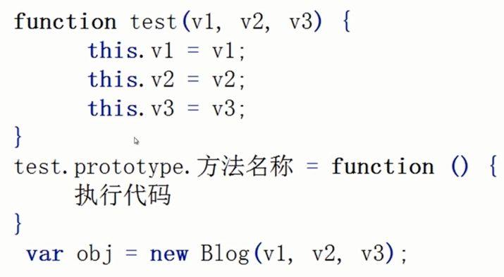

# JavaScript深入

什么是变量？

数据：数字、字符串、布尔、对象、数组等都是数据

只使用一次的话可以直接用

多次使用的情况就会使用容器保存，这个容器也就是变量。

变量的命名：

由`$ _ 字母 数字`组成，不能以数字开头。

不能使用已保留的关键字： `if for ...`

不能使用保留字：`class ...`

单词间的连接： 以`_` 连接或者驼峰形式。

声明：

`var` 如果在声明的同时不赋值的话，默认就会赋值undefined。

# 变量

## 数据类型

### 基本类型

数字number

字符串string

布尔bool

undefined

null

基本类型的值是不可以修改的，只能覆盖

也就是说，所有关于字符串的操作都是返回一个字符串，而不会直接修改字符串

基本类型是无法添加属性的，这里解释:`'string'.replace`

为什么基本类型string可以使用replace方法？ 是因为当基本类型调用方法的时候，会寻找它的包装对象String，使用的是包装对象的方法。

基本类型不可修改，大小不变，也就保存在**栈内存**中。

### 引用类型

数组array

对象object

引用类型的值是可以修改的

引用类型可修改，大小不固定，只能保存在堆内存中。

## 堆栈

数据保存在硬盘上，在使用的时候会放在内存上。

又分为 堆内存、栈内存。

**栈内存**会分成几块地址，是有序的，但是大小是固定的。


**堆内存**里面是无序排列，大小不固定。

堆内存中存储的数据因为位置不固定所以不好找，所以需要明确它们的地址，地址是固定的大小，所以地址可以存储在栈内存中，就可以轻松找到引用对象了。

### 变量比较

```javascript
// 基本变量间的比较
var a = 4;
var b = 4;
a === b;  // true 全等

// 引用变量的比较
var vm = {
    age: 18,
    score: 4
}
var xh = {
    age: 18,
    score: 4
}
vm === xh;  // false 指向不同的空间所以不相等，引用对象只有指向相同空间的时候才相等

// 如果只想知道长的是不是一样
// 需要通过遍历比较内容才知道
function equalObjs(a, b){
    for (var p in a){
        if(a[p]!==b[p]) return false;
    }
    return true;
}
// 数组的比较
function equalArrays(a, b){
    if(a.length != b.length) return false;
    for (var i=0;i<length;i++){
        if(a[i]!==b[i]) return false;
    }
    return true;
}
```

### 复制变量的值

```javascript
var a = 4;
var b = a;
a === b;  // true
a++;
b;  // 4  基本类型的值的复制，两个值互不干涉，只是复制。

var xm = {
    age: 18,
    score: 4
}
var xh = xm;
xh.score++;
xh.score;  // 5
xm.score;  // 5
// 因为两个变量指向相同，所以一个变，另一个也会跟着变。
```

所以如果想复制一个 引用对象，又可以像 基本类型一样，只是复制，互不干涉的话：

```javascript
function copyObj(obj){
    var newObj = {};
    for (var p in obj){
        newObj[p] = obj[p];
    }
    return newObj;
}
// 也就是浅拷贝，深拷贝需要递归知识
```

## 参数传递

### 基本类型传递参数

```javascript
function addTen(num) {
    return num + 10;
}
var score = 10;
addTen(score);
// 基本类型传递参数，相当于 num = score，两者没有什么关系。
```

### 引用类型传递参数

```javascript
function setName(Obj){
    return obj.name = 'xm';
}
var person = {};
setName(person);  // 传的其实是地址，按值传递，没有按引用访问
person.name;  //  vm
```

### 检测类型

#### 基本类型的检测

`typeof / typeof()`

#### 引用类型的检测

`[] instanceof Array` Array 是构造函数

instanceof 只能和引用类型连用，不能和基本类型连用

## 变量作用域

变量起作用的区域、范围

1. 变量的生命周期
2. 可以访问到变量的区域
   + 全局作用域
   + 局部作用域

```javascript
var name = 'xm';  // 全局作用域（全局变量）
function fn(argument){
    var sex = 'male';  // 局部作用域/函数作用域（局部变量）
    console.log(sex);  // 可以访问到
}
console.log(sex);  // 报错
```

JavaScript中没有块级作用域，所以在if、for的块中定义的变量也是全局变量。

## 变量对象

全局空间中做主的是window对象，也就是全局变量的变量对象，所有全局空间中的属性和函数，都是window对象的属性和方法。

```javascript
var name = 'xm';

function fn(arg){
    var sex = 'male';
    
    function fn2(arg){
        var age = 18;
    }
}
/*
name 就是 window.name
fn   就是 windo.fn

局部作用域的变量对象看不见摸不着，js引擎在后台运行会使用

*/
```

**注意：** 访问不存在的属性也不会报错，而是会显示undefined

## 作用域链

作用域链主要是为了查找变量引出的

函数作用域

```javascript
var name = 'xm'

function fn(){
    var name = 'xh';
    var sex = 'male';
    
    function fn2(){
        var name = 'xhei';
        var age = 18;
    }
}
```


当在一个作用域中使用变量时，会沿着作用域链进行，优先在当前作用域中查找，找到的话就不在往外找，找不到就会往外找。

也就是说，同名的变量越往内优先级越高。

而且当前局部作用域的查找速度会快于外部作用域

所以jQuery的代码，会把window对象作为一个参数传入到函数里面，而不是直接使用，速度会更快，而且方便压缩代码。

### 延长作用域链

```javascript
var person = {};
person.name = 'xm';
person.sex = 'male';
var score = 4;
console.log(person.name);  // xm
console.log(person.sex);  // male
console.log(score);  // 4

with(person){  // 尽量不要使用with
    name = 'xh';
    sex = 'female';
    score = 44;
}
console.log(person.name);  // xh
console.log(person.sex);  // female
console.log(score);  // 44
```

## JS解析机制

1. 预解析

   分别在各个作用域里进行预解析，先在window中预解析。预解析的时候就会给赋值undefined。

2. 逐行解析

```javascript
var name = 'xm';
var age = 18;

function fn(){
    console.log(name);  // undefined
    var name = 'xh';
    var age = 10;
}
```

**注意：** 在某些火狐老版本的浏览器中，js预解析无法解析到if、for 块里面的代码，所以函数尽量不要声明在if、for的块里面。

## 垃圾收集机制

释放无用的数据，回收内存。分为自动收集、手动收集。

原理：找出没用的数据，打上标记，释放其内存；周期性执行。

标识无用数据的策略

+ 标记清除
+ 引用计数

### 标记清除

垃圾收集器在运行时，会给内存中的所有变量一次性全加上标记，然后会去掉环境中的变量（还在环境中的变量），以及被环境中变量所引用的变量的标记。

目前几乎所有的浏览器垃圾回收都是用的标记清除的方式，只不过时间间隔有区别。

### 引用计数

每次有变量引用值的时候，这个值的引用计数就+1。

```javascript
var xm = {
    name: 'xm',
    age: 18
};  // 1
var xh = xm;  // 2
xh = {};  // 1
xm = {};  // 0
```

但是引用计数会有循环引用的现象

```javascript
// 循环引用
function fn(arg){
    var xm = {};  // 1
    var xh = {};  // 1
    // xm、xh都是局部变量，所以执行完一次以后就会被销毁
}
fn();
xm = null;  //0
xh = null;  //0
/*  -----------------------------------------------  */
function fn(arg){
    var xm = {};  // 1
    var xh = {};  // 1
    
    xm.wife = xh;  // 2
    xh.husband = xm;  // 2
}
fn();
xm = null;  // 1
xh = null;  // 1
```

IE9 之前的浏览器版本

JS: DOM和BOM

IE9之前的浏览器的DOM和BOM对象不是原生的，而是通过C++在COM对象的基础上实现的，COM对象的实现就采用的引用计数的垃圾回收机制，所以即使IE老版本浏览器JS引擎使用的是标记清除的策略，但是因为COM，所以还是可能会出现循环引用的问题。

```javascript
var obj = {};  // 原生对象，标记清除策略
var elem = document.getElementById('box');  // DOM元素

// 那么下面还是会出现循环引用的问题
elem.someAttr = obj;
obj.someProperty = elem;

// 解决方法
elem.someAttr = null;
obj.someProperty = null;
```

## 内存管理

操作系统在分配内存时，Web浏览器 < 桌面应用程序。

对用不到的数据，设置为null，解除引用，马上释放内存。

# 对象

对象就是任意值的集合

JS中的值有 字符串、布尔、数组、函数、对象，都是值，也都可以用来构成对象。

## 创建

```javascript
var cat = {
    'name': 'Tom',
    'age': 4,
    'family': ["did", "mother"],
    'speak': function(){  // 对象中的函数叫做方法，方法也是对象的属性，只不过别名叫方法
        console.log("喵喵");
    },
    'friend': {
        'name': 'Jerry',
        'age': 4,
    }
};  // 键值对就是对象的一个属性，属性名： 属性值
// 这样只使用一个全局变量就可以了，可以防止全局变量冲突
```

另一种创建方法： 构造函数 `new`

```javascript
var cat = new Object();
// 相当于 var cat = {};
```

ES5中新增的创建方法：

```javascript
Object.create();  // 有兼容性问题，作为了解
```

## 读取、设置 属性

```javascript
// 读取属性有两种方法，通过点、通过方括号
cat.name;
cat["name"];
// 赋值也有两种方法，通过点、通过方括号
cat.name = "Tim";
cat["name"] = "Tim";
```

## 删除 属性 delete

delete

```javascript
delete cat.type;
```

## 判断是否有属性 in

```javascript
"name" in cat;  // 返回布尔类型的值
```

## 枚举

for in 属性

```javascript
for(var p in cat){
    console.log(p);
    // 下面就是 点语法 和 方括号语法 的区别。
    console.log(cat.p);  // 这么写是错的，p就变成了属性
    console.log(cat[p]);  // 正确写法，这里就会先计算p的值
}
```


# 函数

一次定义，多处调用。

```javascript
// 函数的定义
function add(num1, num2){
    return num1 + num2;;
}
// 函数的调用
add(1, 2);
/*
`function`关键字会告诉JS的解析器（浏览器），我是函数。
add 是函数名，函数保存在内存中，需要使用标识符找到这个函数，也就是函数名，没有名字的函数叫做匿名函数。
花括号里面的内容就是函数体，用来封装代码，函数体里就是一个局部作用域。
return： 函数结束的标志、返回。

*/
```

## 定义和调用时发生了什么

定义函数的时候，函数体里的代码不会执行，只是封装，只有当调用的时候，代码才会执行。

浏览器环境下，全局变量是`Window`

1. 函数定义以后，会在window节点下增加了add方法
2. 函数调用以后，会在add下创建局部作用域，里面有`num1`、`num2`，然后开始赋值，把实参赋值给形参。
3. 函数执行完毕后，会将创建的局部作用域连同局部变量销毁掉，但是add节点是不会销毁的，所以可以进行多次的执行（调用），每次调用都会重新创建局部作用域。

## 为什么要使用函数

1. 代码复用。
2. 统一修改和维护。
3. 可读性好，化繁为简。

## 函数的本质

1. 可调用性

2. 函数也是对象

   ```javascript
   new Function('num1', 'num2', ..)
   ```

   函数也可以添加属性和方法

   ```javascript
   function add(num1, num2){
       return num1 + num2;
   }
   add.sex = 'male';
   add.setSex = function(sex){
   	this.sex = sex;
   }
   console.log(add.sex);  // male
   console.log(add.setSex('famale'));  // undefinded
   console.log(add.sex);  // female
   console.log(add(1, 2));  // 3
   ```

3. 作为数据值使用

   ```javascript
   var add = function (){
       return 1;
   }
   add();
   console.log(add());  // 1
   console.log(add);  // 函数本体
   ```

   在数组、对象中也可以存函数

4. 作为参数使用

   ```javascript
   // setTimeout(function(){
   //     console.log(1);
   // })
   setTimeout(fn, 1000);  // 传入函数体 而不是执行函数
   function fn(){
       console.log(1);
   }
   ```

5. 作为返回值

   ```javascript
   function fn(){
       return function(){
           console.log(1);
       };
   }
   // var newFn = fn();
   // newFn();  // 1
   fn()();
   ```

## 函数的定义

1. 字面量 定义

   ```javascript
   function add(argument){
       // body...
   }
   add();
   
   var add = function fn(argument){
       // body...
       // add 是对外对内都可以使用的，fn只能在函数体内使用
   };
   add();
   ```

2. 构造函数

   ```javascript
   // 必须要用字符串
   var add = new Function('num1', 'num2', 'return num1+num2;');
   add();
   ```

### 三种方式的区别

字面量方式更直观、更方便书写，更加省时，效率高。

函数声明、赋值语句：预解析的区别。

函数声明的方式，先定义或者先调用都可以。

赋值语句的方式，先定义可以，但是先调用的话就会报错，找不到函数。

是因为预解析的时候，解析器会先寻找开头关键字`var`、`function`，var在预解析的时候会默认赋值undefined，所以不是一个函数。

### 三种方式的选择

构造函数的方式一般不会使用，主要是字面量的方式。

而字面量中的两种方式根据风格来。

### 函数定义的位置 实战

```javascript
// 全局作用域
function add(){  // 在函数前、后、内、外 都可以找到这个函数
    // body
}

// 函数作用域， 遵循作用域链
function add(){
    function fn(){  // 函数自己内部、父级内部 可以找到
        // body ...
    }
    function fn2(){
        // body ...
    }
}

// if、for 代码块， 最好不要在里面声明函数
// 需要注意的是，if、for代码块中属于全局作用域，所以两个函数都会声明
if(true){
    function add(){
        //body
    }
}else {
    function subtract(){
        // body
    }
}
// 函数的赋值
// 这样写的话，就可以实现  在特定的条件下声明函数
if(true){
    var add = function(){
        // body
    }
}else {
    var subtract = function(){
        // body
    }
}

// 对象中的函数定义，也就是方法
var person = {
    name: 'xm',
    setSex: function(sex){
        this.sex = sex;
    }
};
person.setName = function(name){
    this.name = name;
}
person.setSex();
```

## 函数的调用

### 普通函数

```javascript
// 命名函数
function add(){
    // body
}
add();

// 匿名函数
var add = function(){
    // body
}
add();
function(){  // 这样是不能调用的，JS解析器的问题
    // 解析会认为这是一个声明，因为是function开头的，所以不能在声明的同时调用
    // body
}();
// 解决办法
var add = function(){
    // body
}(); // 匿名函数的自我执行
(function(){  // 避免了function打头，也就解决了问题
    // body
})();
// 还有在function之前加 !+-~都可以
```

### 递归调用

`5! = 5 *4 * 3 * 2 * 1`

```javascript
function factorial(num){
    if(num <= 1) return 1;
    return num * factorial(num - 1);
}
```

### 方法的调用

```javascript
var operation = {
    add: function(num1, num2){
        return num1 + num2;
    },
    subtract: function(num1, num2){
        return num1 - num2;
    }
};
operation.add(1, 1);
operation.subtract(2, 1);
//
document.onclick = function(){
    console.log('你点击了文档.');
};
document.onclick();  // 模拟鼠标点击，适用于其他各种事件
/* 
对象里的属性，要不要加引号引起来？
对于合法的标识符，加不加引号都可以，都不会报错
但是对于一些不合法的标识符，就会报错，就用引号引起来。
*/
```

### 链式调用

```javascript
$('p').html('段落').css('background-color', 'red')...;
// 自己写链式调用
var operation = {
    add: function(num1, num2){
        console.log(num1 + num2);
        return this;
    },
    subtract: function(num1, num2){
        console.log(num1 - num2);
        return this;
    }
};
operation.add(1, 2).subtract(2, 1);
```

### 构造函数的调用

```javascript
function add(){
    // body
}
function Person(){
    // body
}
add();
new Person();  // 返回的是一个对象，加上new调用才是构造函数，不加new调用就只是一个普通函数。
new Object();
```

### 函数的间接调用

每个函数下都会有 `call` 、`apply` 两个间接调用方法。

```javascript
// function add(){
//     // body
// }
// add();
// add.call
// add.apply

var name = 'xm';
var person = {};
person.name = 'xh';
person.getName = function(){
    this.name;  // 这里的this指向的是person
}
console.log(person.getName());
// call方法里的参数作用：改变this的位置，后面的参数才是传参
console.log(person.getName.call(window));

// apply第一个参数也是改变this指向

function add(num1, num2){
    return num1 + num2;
}
console.log(add.call(window, 1, 2));  // call方法传参只需要按顺序传就好
console.log(add.apply(window, [1, 2]));  // apply方法传参的时候要用数组
// 可以在继承中使用 call和apply，可以使用父类中的一些方法和属性

// 帮助判断数据结构 instanceof
```

## 参数

### 参数的类型

```javascript
function add(num1, num2){  // 形参，只是一个占位符，当成var声明的局部变量，会预解析
    return num1 + num2;
}
add(1, 2);  // 实参
// 本质： 把实参赋值给形参，1->num1, 2->num2

// 如果是把对象（引用类型）当做参数传递的话， 赋值的是地址
obj = person;  // 指向同一个对象，所以在函数内做的对对象的操作，会影响外面的对象，也就是对形参的修改会影响实参
```

### 参数的个数

```javascript
function add(num1, num2){
    // body
}
```

1. 实参 == 形参

   ```javascript
   add(1, 2);
   ```

2. 实参 < 形参

   ```javascript
   add(1);
   // 1->num1 ,undefinded->num2
   ```

   可选参数

   ```javascript
   function pow(base, power){
       return Math.pow(base, power);
   }
   console.log(pow(3, 2));
   console.log(pow(2, 2));
   
   // 改写， 默认是2次幂
   function pow(base, power){
       // if(!power) power = 2;
       power = power || 2;
       return Math.pow(base, power);
   }
   console.log(pow(3));
   // jq里的，在什么上下文中选
   $('p', document.getElementById('box'))  // 缺省就选择默认的
   ```

3. 实参 > 形参  arguments

   ```javascript
   add(1, 2, 3, 4);  // 不限制参数的个数
   // 改写函数
   function add(){
       // 使用arguments类数组，里面保存的是所有的参数
       if(arguments.length == 0) return;
       var sum = 0;
       for(var i = 0;i < arguments.length; i++){
           sum += arguments[i];
       }
       return sum;
   }
   ```

### arguments

类数组，一个对象，没有数组独有的push等方法。

**注意：**

1. arguments里面的每一个数据，和形参是一一对应的。

   ```javascript
   function fn(name){
       arguments[0] = '';
       console.log(name);  // ''
   }
   fn('am');  // ''
   // 对于不可变类型string，name和arguments[0]指向的是同一个地址，修改一项会对另一项造成影响，所以尽量不要对arguments进行改操作，会影响形参
   ```

2. arguments是每个函数中独有的。

3. `arguments.callee` 这个属性是指函数本身。

   ```javascript
   function add(num1, num2){
       console.log(arguments.callee);  // 会打印出函数本体
       return num1 + num2;
   }
   add();
   ```

   **注意：**  严格模式`use strict` 下，不适用var 声明的变量会报错，而且不能使用`arguments.callee`

### 什么可以做参数

数字、字符串、布尔值、undefined（参数设计不合理时会使用）、null（同undefined）、数组、对象、函数。

```javascript
// 传数组实例
$.each([1, 2, 3], function(index, item){
    console.log(index);
    console.log(item);
})
// 相当于
for (var i=0; i<[1,2,3].length; i++){
    console.log(index);
    console.log(item);
}
/* -------------------------------------------------- */
// 传入对象
function setPerson(name, sex){
    var person = {};
    person.name = name;
    person.sex = sex;
}
setPerson('xm', 'male');
// 需求变了，需要添加不定长参数给到person
function setPerson(obj){
    
    var person = {};
    person.name = obj.name || 'xh';
    person.sex = obj.sex || 'male';
    person.age = obj.age || '18';
    person.tel = obj.tel || '110';
    person.addr = obj.addr || 'China';
}
setPerson({
	name: 'xm',
    age: '18',
    addr: 'China',
    sex: 'male',
});
```

### return

在函数中使用

函数的输出

表示函数的结束，并将值返回。

### continue

在循环中使用

表示跳出本次循环，并不是跳出所有循环

### break

在循环中使用

表示跳出所有循环

### 什么可以作为返回值

和参数差不多，只要是数据就都可以返回。


# 实现简易计算器

## 结构和样式

结构

```html
<!-- 简易计算器 -->
<div id="calculator">
	<p>
		<input class="formerInput" value="1" type="text"></input>
		<span class="sign">+</span>
		<input class="laterInput" value="1" type="text"></input>
		<span>=</span>
		<span class="resultOutput">2</span>
	</p>
	<p>
		<input type="button" value="+" onclick="addHandler();">
		<input type="button" value="-" onclick="subtractHandler();">
		<input type="button" value="*" onclick="multiplyHandler();">
		<input type="button" value="/" onclick="divideHandler();">
	</p>
</div>
```

样式

```css
body {
	background-color: #eee;
}
#calculator {
	margin: auto;
}
```

## 添加JS

```javascript
// 获取元素
var calculator = document.querySelector('#calculator');
var formerInput = calculator.querySelector('.formerInput');
var laterInput = calculator.querySelector('.laterInput');
var sign = calculator.querySelector('.sign');
var resultOutput = calculator.querySelector('.resultOutput');


// 加
function addHandler(){
	sign.innerHTML = "+";
	resultOutput.innerHTML = +formerInput.value + +laterInput.value;
}

// 减
function subtractHandler(){
	sign.innerHTML = "+";
	resultOutput.innerHTML = formerInput.value - laterInput.value;
}

// 乘
function multiplyHandler(){
	sign.innerHTML = "+";
	resultOutput.innerHTML = formerInput.value * laterInput.value;
}

// 除
function divideHandler(){
	sign.innerHTML = "+";
	resultOutput.innerHTML = formerInput.value / laterInput.value;
}
```

## 改进一 结构和行为分离

```javascript
// 第一次改进，将结构和行为分离
var btns = calculator.querySelectorAll('.btn');
// 绑定事件
// +
btns[0].onclick = addHandler;
btns[1].onclick = subtractHandler;
btns[2].onclick = multiplyHandler;
btns[3].onclick = divideHandler;
```

## 改进二 使用循环

```javascript
// 第二次改进，使用循环添加事件
for(var i=0;i < btns.length; i++){
	btns[i].onclick = function(){
		switch(this.title){
			case 'add':
			addHandler();
			break;
			case 'subtract':
			subtractHandler();
			break;
			case 'multiply':
			multiplyHandler();
			break;
			case 'divide':
			divideHandler();
			break;
		}
	};
}
```

## 改进三 封装函数

```javascript
// 第三次改进 封装函数
// 绑定事件
each(btns, function(index, elem) {
    // body
    elem.onclick = function() {
        switch (this.title) {
            case 'add':
                addHandler();
                break;
            case 'subtract':
                subtractHandler();
                break;
            case 'multiply':
                multiplyHandler();
                break;
            case 'divide':
                divideHandler();
                break;
        }
    };
});

function each(array, fn) {
    for (var i = 0; i < array.length; i++) {
        fn(i, array[i]);
    }
}

// 更新符号
function updateSign(symbol){
	sign.innerHTML = symbol
}

// 加
function add(num1, num2){
	return +num1 + +num2
}

// 加
function addHandler() {
    updateSign('+');
    resultOutput.innerHTML = add(formerInput.value, laterInput.value);
}

// 减
function subtract(num1, num2){
	return +num1 - +num2
}

// 减
function subtractHandler() {
    updateSign('-');
    resultOutput.innerHTML = subtract(formerInput.value, laterInput.value);
}

// 乘
function multiply(num1, num2){
	return +num1 * +num2
}

// 乘
function multiplyHandler() {
    updateSign('*');
    resultOutput.innerHTML = multiply(formerInput.value, laterInput.value);
}

// 除
function divide(num1, num2){
	return +num1 / +num2
}

// 除
function divideHandler() {
    updateSign('/');
    resultOutput.innerHTML = divide(formerInput.value, laterInput.value);
}
```

## 改进四 管理代码

把calculator下的零散的变量通过一个对象来存取

```javascript
// 第四次修改，管理代码
var wrapElem = document.querySelector('#calculator');
var calculatorElem = {
	formerInput: wrapElem.querySelector('.formerInput'),
	laterInput: wrapElem.querySelector('.laterInput'),
	sign: wrapElem.querySelector('.sign'),
	resultOutput: wrapElem.querySelector('.resultOutput'),
	btns: wrapElem.querySelectorAll('.btn'),
}
// 把小函数分组织
var operation = {
    // 加
    add: function(num1, num2) {
        return +num1 + +num2
    },
    subtract: function(num1, num2) {
        return +num1 - +num2
    },
    multiply: function(num1, num2) {
        return +num1 * +num2
    },
    divide: function(num1, num2) {
        return +num1 / +num2
    }
}
// 然后把使用到的地方的变量修改即可
// 然后把使用到的地方的变量修改即可
```


# 面向对象  OOP

一切事物皆对象。

对代码的一种抽象，对外统一提供调用接口的编程思想。

## 基于原型的面向对象

基于原型的面向对象方式中，对象（Object）则是依靠构造器（constructor）利用原型（prototype）构造出来的。

+ 属性：事物的特征

  事物自身拥有的东西，比如人有名字、身高、体重等。

+ 方法：事物的功能

  比如人可以学习、唱歌、玩耍。

+ 对象：事物的一个实例

  比如是众多人中的一个人。

+ 原型：Js函数中由prototype属性引用了一个对象，即原型对象（原型）。

  prototype在内存中是指向一个地址的，这个地址中存储了一个对象，Object是Js的父对象。

## 创建对象

函数构造器 创造函数对象。

```javascript
var obj = new Function(var1, var2, ..., functionBody());
// var1, var2 正常变量 functionBody() 自定义函数体，可以用到前面的变量
// 注意：构造器构造的对象，效率低
// var1、var2顺序在functionBody中不能变

var obj = new Function('a', 'b', 'return a+b');
var s = obj(2, 5);
alert(s);  // 7
// 说明： 对象分为函数对象、普通对象，通过new Function 创建的对象都是函数对象。
```

## JS闭包

闭包是一个拥有许多变量和绑定了这些变量的环境的表达式（通常是一个函数）。

```javascript
function a(){
	var i = 0;
	function b(){
		alert(++i);
	}
	return b;
}
var c = a();
c();
// 特点：函数b是在函数a内嵌套的，函数a需要返回函数b
```

### 用途

1. 读取函数内部变量

2. 让i 变量的值，保留在内存中

   ```javascript
   function f1(){
       var n = 999;
       nAdd = function(){
           n = n + 1;
       }
       function f2(){
           alert(n);
       }
       return f2;
   }
   var rs = f1();
   rs();  // 999
   nAdd();
   rs();  // 1000
   /// 说明：f2依赖f1，rs一旦声明，f1里的局部变量n就会一直保存在内存中，知道变量被回收。
   ```

### 优缺点

+ 优点： 有利于封装可以访问局部变量
+ 缺点：内存占用事件比较长，浪费严重，容易造成内存泄漏，谨慎使用。

## 声明对象

### 字面式对象声明

Js中最基础的方式

```javascript
var obj = {
    属性名称： 属性值,
    ...
    方法名称: function(){},
    ...
}
//
var person = {
    name: "zhangsan",
    age: 26,
    sex: "man",
    eat: function(fds){
        alert("在吃"+fds);
    },
    play: function(ga){
        alert("我在玩"+ga);
    }
}
person.eat("面条");  // person也是Object的一个子对象
person instanceof Object;  // true
```

### new操作符后跟Object构造函数

```javascript
// Object 对象是所有对象的基类
var obj = new Object();
obj.属性 = 属性值;
...
obj.方法 = function (str){
    方法代码;
};
//
var box = new Object();
box.name = "zhangsan";
box.age = 100;
box.infos = function(str){
    return this.name+'--'+this.age+'---'+str;  // this 为当前对象
}  // 用的时候就可以直接使用box
box.name;
box.infos("吃饭");
```

### JS中构造方法声明对象

```javascript
function test([参数列表]){
    this.属性 = 属性值;
    this.方法 = function(){
        方法代码；
    }
}
var obj = new test(参数列表);
//
function person(name, sex, age){
    this.name = name;
    this.sex = sex;
    this.age = age;
    this.show = function(){
        alert("我是show方法");
    }
}
var obj1 = new person("张三", "man", 18);
obj1.name;
obj1.age;
// 注意：this代表当前对象，obj1和obj2两者之间是独立的，函数内部只能用this访问属性和方法
```

### 工厂方式声明对象

在一个方法中声明一个object对象，并赋予这个对象一些属性和方法，最后返回。

```javascript
function createObject(name, age){
    var obj = new Object();
    obj.name = name;
    obj.age = age;
    obj.run = function(){  // 在obj对象中 调用obj对象的属性，使用this
        return this.name + '--' + this.age + '运行中...';
    }
    obj.say = function(){
        return 'say方法';
    }
    return obj;
}
var box1 = createObject("张三", 18);
box1.name;  // 张三
box1.age;  // 18
box1.run();  // 张三--18运行中

var box2 = createObject("李四", 20);
box2.say();  // say方法

// box1和box2两个对象是没有关系的，是独立存在的。
```

### js中原型模式声明对象

任何js方法，都有一个prototype属性，且它以对象方式存在。

**原型模式根本：** 函数本身声明为空内容，利用prototype定义一些属性和方法。	

好处：可以让所有的实例共享它包含的属性。

```javascript
// 原型模式
function test(){
    
};
test.prototype();  // 一个Object对象，自带的。
test.prototype.color = "red";
test.prototype.heights = "1.7";
test.prototype.widths = "1.2";
test.prototype.showInfo = function(){
    alert(this.color+this.heights+widths;)
}
var car1 = new test();
car1.color;  // red
..
car1.showInfo();  // 调用成功
// json数据的方式定义属性和方法，和上面一样的效果
test.prototype = {
    color: "red";
    heights: "1.7";
    widths: "1.2"; 
    showInfo：function(){
    	alert(this.color+this.heights+widths;)
	}
}
```

### 混合模式

也就是构造+原型 的模式



```javascript
// 混合模式： 构造+原型
function blog(name, url, friend){
    this.name = namel
    this.url = url;
    this.friends = friends;
}
blog.prototype = {
	showInfo: function(){
    	alert(this.name+this.url+this.frients);
	},
    gets: function(){
        alert(this.friends);
    }
}
```

## 对象的遍历

对象可以当做数组处理

```javascript
var ren = {};
        ren.name = "zhangsan";
        ren.age = 18;
        ren.demo = function () { 
            document.write("aaa");
         }
for(var i in ren){  // i 是所有的属性或者方法名称
    alert(ren[i]);
}
```

## 对象的存储

对象在内存中的分布

一般会把内存分为： 堆内存、栈内存、代码段、数据段。

对象就是一个引用，引用到了一个地址，16进制的数字，这个地址上面描述了内存中的属性和方法，属性和方法在堆内存中存储着，function、alert等是放在代码段中，两个对象之间是互相独立的。

## 封装 Encapsulation

把对象内部数据和操作细节进行隐藏

大多面向对象的语言都支持封装的特性，提供了private关键字来隐藏某些属性或方法，用来限制被封装的数据或者内容的让问，只对外提供一个独享的专门访问的接口。也就是调用方法。

但是在JS中没有提供关键字，只通过闭包来实现封装。

```javascript
// 封装
function demo() { 
    var n = 1;  // 局部变量，在方法外部不能直接访问
    function test() {   // 出口，特权方法
        return n++;
     }
    test();
    return test;
 }

alert(demo());
```

## 原型和原型链

原型：是利用prototype添加属性和方法。

原型链：JS在创建对象（不论是普通对象还是函数对象）的时候，都有一个叫做`__proto__`的内置属性，用于指向创建它的函数对象的原型对象的prototype。

```javascript
// js 继承
// 原型：用prototype对象来添加属性和方法
var person = function () { this.name = "zhangsan" };

var p = new person();  // 经历了下面三个阶段
// 1 
var p = {};   // 创建对象
// 2
p.__proto__ = person.prototype;  // __proto__自带的一个属性
// 3 创建对象（初始化对象）p --> person.call(p)
alert(p.__proto__ == person.prototype);  // true

// 实例
var person = function () { this.name = "zhangsan" };
person.prototype.say = function () { 
    alert("天气挺好");
 }
person.prototype.gongzi = 500;
var programmer = function () {  };

console.log(programmer.prototype);  // {constructor: ƒ}
programmer.prototype = new person();  // 注意这！把programmer的原型指向了person;
console.log(programmer.prototype);  // person {name: "zhangsan"}

programmer.prototype.wcd = function () { 
    alert("明天天气也不错");
 }
programmer.prototype.gongzi = 1000;
var p = new programmer()
p.say();  // 成功调用
p.wcd();  // 成功调用
```

## 构造继承

在子类内部构造父类的对象实现继承

 ```javascript
function parents(name){
    this.name = name;
    this.say = function(){
        alert("父亲名："+this.name);
    }

function child(name, age){  // 继承parents
    this.pObj = parents;  // 子对象的参数name就传到了父对象中了
    this.pObj(name);
    this.age = age;
    this.sayC = function(){
        alert("子名字："+this.name+"age:"+this.age);
    }
}
var p = parents("zhangsan");
p.say();  // 成功调用
var c = new child("李四", 20);
c.sayC();  // 成功调用
 ```


## js 面向对象的关键词

+ instanceof

  变量是否是对象的实例

  ```javascript
  var arr = new Array();
  alert(arr instanceof Array);  // true
  alert(arr instanceof Object);  // true
  ```

+ delete

  删除对象的属性

  ```javascript
  function fun(){
      this.name = "zhangsan";
      this.say = function(){
          alert(this.name);
      }
  }
  var obj = new fun();
  alert(obj.name);  // zhangsan
  delete obj.name;  // 作为运算符存在了，而不是方法
  alert(obj.name);  // undefinded
  // delete不能删除方法，也不能删除变量，而且不能删除原型链中的属性
  ```

+ call、apply

  ```javascript
  function animal(){
      this.name = "ani";
      this.showName = function(){
          alert(this.name);
      }
  }
  function cat(){
      this.name = "cat";
  }
  var an = new animal();
  var c = new cat();
  // an.showName.call(c, ",");  // 通过call方法，将showName --> cat使用了
  an.showName.apply(c, []);  // 同call方法一样
  ```
  
+ callee

  返回正在执行的function对象，function内容

  callee是arguments的一个属性，默认值是正在执行的function对象

  ```javascript
  function demo(){
      alert(arguments.callee);  // callee当作属性，返回整个函数的内容
      alert(arguments.callee());  // 报错，死循环，最大栈被占用
  }
  demo();
  // 可以写递归
  ```

+ arguments 

  每个函数都有一个Arguments对象的实例arguments，引用函数的参数（实参）

  可以用数组下标方式引用arguments元素

  `arguments.length`，参数个数

  `arguments.callee`，引用函数自身

  ```javascript
  function test(a,b,c){
      alert(arguments.length);  // 3
      alert(arguments[0]);  // 1
  }
  test(1,2,3);
  ```

+ this **重要**

  1. this作为函数调用

     ```javascript
     function test(){
         this.x = 1;  // 这里的this就是全局变量global， 相当于 x=1
         alert(this.x);  // 1
     }
     test();
     ```

  2. 作为方法调用  -->  构造函数内this指向当前对象

     ```javascript
     function test(){
         this.name = "zhangsan";  // this表示当前对象
         this.age = 18;
     }
     var t = new test();
     alert(t.name);  // zhangsan
     ```

  3. 在call、apply中使用，this第一个参数

     ```javascript
     var x = 0;
     function test(){
         alert(this.x);
     }
     var o = {};
     o.x = 1;
     o.m = test;
     o.m.allpy();  // 0
     o.m.apply(o);  // 1
     ```

## 对象冒充

将父类的属性和方法一起传给子类作为特权属性和特权方法。

```javascript
// 对象冒充
function person(name, age){
    this.name = name;
    this.age = age;
    function sayHi = function(){
        alert("hi");
    }
}
person.prototype.walk = function(){
    alert("walk");
}

function students(name, age, grade){
    this.newMethod = person;
    this.newMethod(name, age);  // 可以冒充是person对象，传递特权属性和特权方法给子类了
    this.grade = grade;
}
var s1 = new student("zhangsan", 15, 5);  // s1 是students独享，继承person
// 注意，s1继承了person中的特权方法和属性，但是没有继承共有方法和属性
```

# 正则表达式 regular expression

正则表达式是由普通字符（例如26个英文字母、数字等）以及特殊字符（有特殊含义的，例如 `.` `\`等）组成的文字模式。

该模式描述在查找文字主题时待匹配的一个或多个字符串。正则表达式作为一个模板，将某个字符模式与所搜索的字符串进行匹配。

正则可以用来做查找、替换、数据有效性验证。

## 创建方式

1. 字面量或直接量

   ```javascript
   /js/
   ```

2. 构造函数

   ```javascript
   new RegExp();
   ```

初识正则：

```javascript
var str = "I love js";
var pattern = /js/;
// 两种正则方法 test exec
pattern.test(str);  // 找到就返回true，找不到就返回false
pattern.exec(str);  // 找到就把找到的字符串组成数组，然后返回。 // ["js"]，找不到返回null
// 修饰符
/*
i	:	ignoreCase	忽略大小写
g	：	global		全局匹配
m	：	multiline	多行匹配
*/
var pattern = /js/i;  // 修饰符可以连用，直接在i后面或前面加上就可以

// 构造函数写法
var str = "I love js";
var pattern = new RegExp("js", "i");
console.log(pattern.test(str));
console.log(pattern.exec(str));
```

使用构造函数的写法，是把正则规则以字符串的模式传递的，所以可以改变，更灵活。

## 特殊字符

```javascript
var str = '// 我是注释';
var pattern = /\/\//;

var str = '\\';  // 一条反斜杠
var pattern = /\\/;  // 一条反斜杠

\	转义符
\n	换行符
\t	制表符

// \u4e00 ~ \u9fa5
var str = "Alex帅";
var pattern = /[\u4e00-\u9fa5]/;  // 匹配汉字

// 
var str = 'javascript';
var pattern = /[js]/;
```

## 字符类

+ `[] `中括号

  表示匹配中括号中的任意一个字符，先匹配到谁就是谁

  `[a-z]`  a到z之间的任意字符 `[a-zA-Z]` `[a-zA-Z0-9]`

+ `^` 取反

  ```javascript
  var str = 'javascript';
  var pattern = /[^js]/;  // 表示匹配除了js之外的所有字符
  pattern.exec(str);  // a
  ```

+ `.` 除了换行符之外的所有字符

  ```javascript
  var str = '3.1415926';
  var pattern = /./;
  pattern.exec(str);
  ```

+ `\w`  表示 `[a-zA-Z0-9_]`

+ `\W` 表示小写w的取反 `[^a-zA-Z0-9_]`

+ `\d` 表示`[0-9]`

+ `\D` 表示 `[^0-9]`

+ `\s` 表示 空格和制表符，以及Unicode中的其他空白字符

+ `\S` 小s取反

