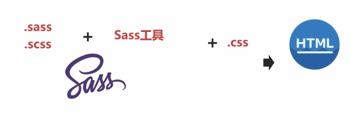

# Sass基础

## Sass整体介绍

官网介绍Sass是CSS扩展语言。Sass是基于Ruby语言开发的。

CSS预处理工具。

需要前置文件，然后进行编译解析，最后生成CSS。



+ 嵌套规则

  通过花括号的方式解决复杂的css父子样式嵌套问题。

+ 变量规则

  通过变量将公共样式抽离，减少冗余css代码。

+ 条件逻辑

  向高级语言一样编写逻辑性的css代码

# Sass基础知识

## 变量和引用

+ 定义

  ```scss
  // 常规类型
  $width: 300px;
  $height: 300px;
  // 颜色类型
  $color: #e03434;
  
  .div1 {
      width: $width;
      height: $height;
      
      background-color: $color;
  }
  
  // default语法
  $baseWidth: 200px;
  $baseWidth: 100px;  // 如果这么写，200就会被100覆盖掉
  $baseWidth: 100px default;  // 加上default语法的话，100就变成了默认值，其他地方可以把这个值覆盖掉。
  
  // 字符串类型
  $str: 'hello.jpeg';  // 加引号的字符串
  .div1 {
      background-img: url('./img/'+$str);  // 字符串可以拼接，使用+
  }
  $strNoQout: abc;  // 也可以正常使用
  // 字符串连接，插值变量的语法
  background-img: url('./img/#{$strNoQout'});  // #{}
  // 插值变量还可以用在很多地方
  $class: '.div';
  #{$class}{
      ...
  }
  ```

+ 作用域

  ```scss
  $width: 300px;
  $color: #ffe932;
  
  .div1 {
      width: $width;
      height: $height;
      
      $widthInner: 100px;
      width: $widthInner;  // 这里不会报错，可以找到
  }
  .div2 {
      width: $widthInner;  // 这里会报错，找不到
  }
  ```

+ import

  css原生在每次import的时候都需要发送请求，不友好不推荐使用。

  sass的import是在编译的时候一起编译。

  ```javascript
  /*
  为了和css原生的import区分开，sass约定，满足一下四个条件中的任何一个，sass在编译的时候就不会编译成sass特有的语法
  1. import的是以 .css结尾的名字
  2. import的是以 http:// 开头的
  3. 使用url()包裹的
  4. 引入任何 media queries 的样式
  */
  @import '.org.css';  // 这种形式会认为是css原生的import
  $width: 300px;
  $color: #ffe932;
  
  // 在sass中约定，将想要引入的文件以下划线_开头，在引入的时候把 下划线和扩展名 去掉。
  // 新建 _base.sass 文件
  @import base;  // 去掉 下划线和扩展名 引入。
  $width: 300px;
  $color: #ffe932;
  ```

  import的位置不同，可能会出现声明的变量被覆盖的情况，如果想避免这种情况，就可以使用default生命方式，所以被引入的文件中的变量如果使用default方式声明的话，就不需要担心了。

# Sass数据类型

```scss
// number
$width: 300px;
$zoomValue: 2;

// color
$color: red;
$color: #ffe932;

//string
$str: 'hello.jpeg';

// list
$list: (100px, 200px, 300px, 400px, 2, 'string');
// list 的常见用法
.div {
    width: nth($list, 1);  // nth方法 提取到了list的第1个元素，而且下标是从1开始的。
    height: nth($list, 2);
    zoom: nth($list, 5);
}
// index 找到指定元素的数字下标
index($list, 'string');  // 6

// map  类似对象
$map: (top: 1px, left: 2px, bottom: 3px, right: 4px);
.div {
    top: map-get($map, top);  // 使用map-get 方法，传入key获取value
}
.div {
    @each $key, $value in $map {  // 把map遍历一下，然后依次把key作为属性，value作为值
        #{$key}: $value;
    }
}
```

# Sass基本运算

```scss
$num1: 100px;
$num2: 200px;

$width: $num1 + $num2;  // 加
.div {
    width: $width;
}
// 加减乘除
font: (10px / 8);  // 除法， 1.5px
font: (10px * 8);  // 乘法, 
width: $width / 2;  // 使用变量就不需要加括号了

// 颜色运算
$color1: #010203;
$color2: #040506;
$color3: #a69e61;
.div {
    color: $color1 + $color2;  // 会警告，直接颜色相加的方式已经过期，后期可能会废弃，建议使用color方法   结果： #050509，是对每一位进行相加
    
    color: mix($color1, $color2);  // 混合色， #030405
    color: red($color3);  // 166
    color: green($color3);  // 158
    color: blue($color3);  // 97
}

// 字符串运算
$str = 'hello.jpeg';
.div {
    background-image: url('images/'+$str);
}

// mixin 语法块
// 一般的mixin
@mixin helloMixin {
    display: inline-block;
    font: {
        size: 20px;
        weight: 500;
    }
    color: red;
}
.div {
    width: 100px;
    @include helloMixin;
}

// 嵌套mixin 一定要注意是否使用了相同的属性
@mixin helloMixin2 {
    padding: 10px;
    @include helloMixin;
    background-color: red;
    font: {
        size: 20px;
        weight: 500;
    }
    color: red;
}
.div {
    width: 100px;
    @include helloMixin2;
}

// 参数mixin
@mixin sexy-border($color, $width){
    border: {
        color: $color;
        width: $width;
        style: dashed;
    } 
}
.div {
    width: 100px;
    $include sexy-border(blue, 2px);
}
```

# Sass继承  @extend

```javascript
// 简单继承
.div {
    border: 1px;
    background-color: red;
}
.divext {
    @extend .div;
    border-width: 3px;
}

// 关联属性继承
.div1 {
    border: 1px;
    background-color: red;
}
.div1.other {
    background-image: url('hello.jpeg');
}
.divext {
    @extend .div;
}

// 链式继承
.div1 {
    border: 1px soild #000;
}
.div2 {
    @extend .div1;
    color: #red;
}
.div3 {
    @extend .div2;
    color: #000;
}

// 在链式继承中，相同的属性名是不会合并的

// 伪类继承
a:hover {
    text-decoration: underline;
}
.hoverlink {
    color: red;
    @extend :hover;
}
// 效果：
a:hover, a.hoverlink {
    text-decoration: underline;
}
.hoverlink {
    color: red;
}
```

# Sass嵌套

```scss
// 通过括号的层级让代码更清晰
$width: 300px;
$color: #fff;

.div1 {
    width: $width;
    height: $width;
    background-color: #color;
    
    .div-inner {
        width: $width;
        height: $width;
        background-color: #color;
        
        .div-inner-inner {
            ...
        }
    }
    a {
        color: red;
    }
}

// 另一种嵌套方法： css中以横杠- 隔开的属性都可以用mixin的方式写
.div1 {
    width: $width;
    height: $width;
    background-color: #color;
    
    .div-inner {
        border: {
            left: 1px solid #000;
            top: 2px solid #000;
        };
        background: {
            image: url('abc.png');
            color: #000;
        };
    }
    a {
        color: red;
    }
}
```

# Sass的条件控制语句

```scss
// if
$type = 'tony';

p{
    @if $type == 'bufy'{
        color: red;
    } @else if type == 'tim' {
        color: blue;
    } @else if $type == 'tony' {
        color: green;
    } @else {
        color: black;
    }
}

@if $type == 'bufy' {
    .div{
        color: red;
    }
} @else {
    .div {
        color: red;
    }
}

// for
@for $i from 1 through 3 {  // through 可以改为 to，使用through的话包括3，to知道2 
    .item#{$i} {
        width: 1px * $i; 
    }
}
// 效果
.item1 {
    width: 1px;
}
.item2 {
    width: 2px;
}
.item3 {
    width: 3px;
}

// for list
$list: (1,2,3,4,5);
@for $i from 1 to length(list) {
    .item#{$i} {
        width: 1px * $i;
    }
}
// while
$i: 6;
@while $i > 0 {
    .item#{$i}{
        width: 1px * $i;
    }
    
    $i: $i-2;
}
```

