#  生命周期

## 图示

# 选项数据 data

+ data
+ computed
+ methods

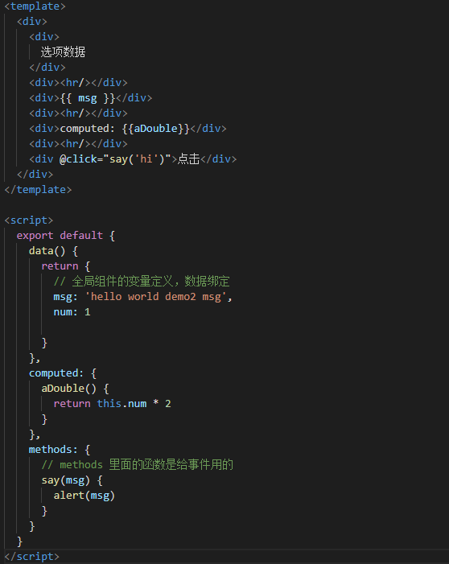

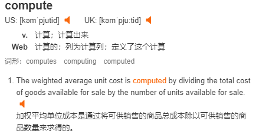

# 模板语法

+ data
+ 模板中直接嵌入js代码
+ 指令 v-html、v-on、v-bind等
+ 计算属性
+ 过滤器

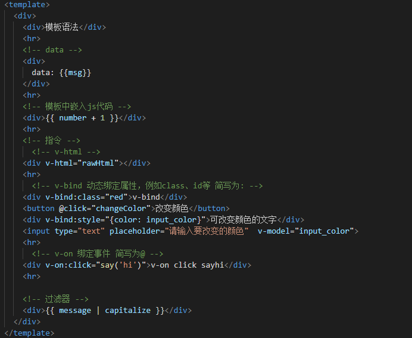

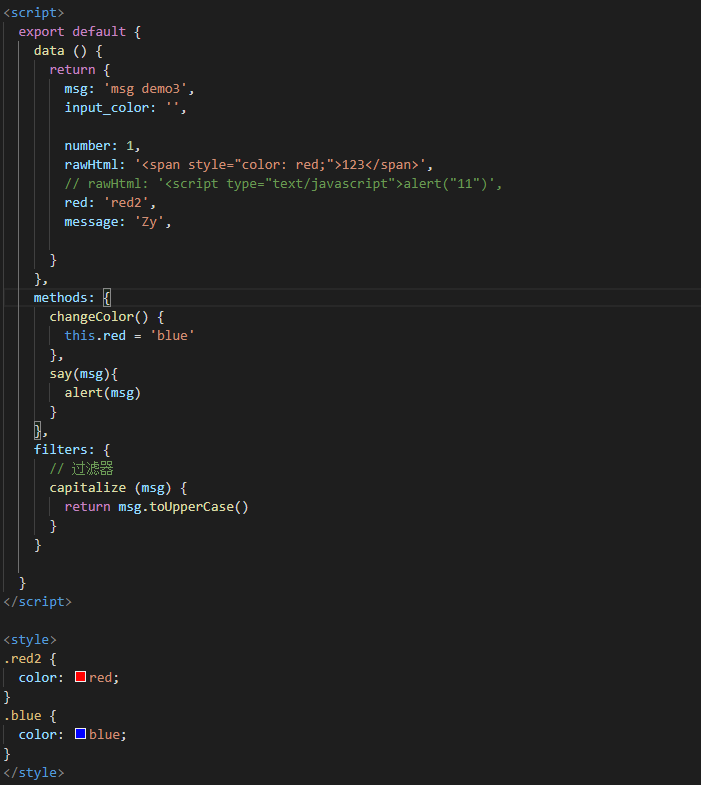

# 计算属性 computed

+ 在模板中放入太多的逻辑会让模板过重且难以维护
+ 计算属性下所有函数可以放到computed中

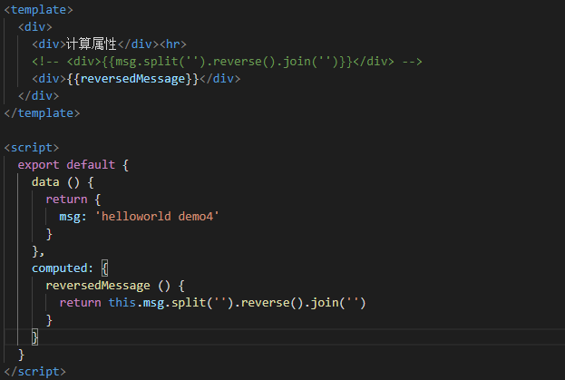

# Class与Style动态绑定  v-bind

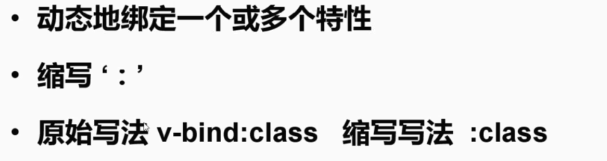

## class 绑定方式

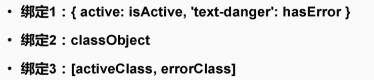

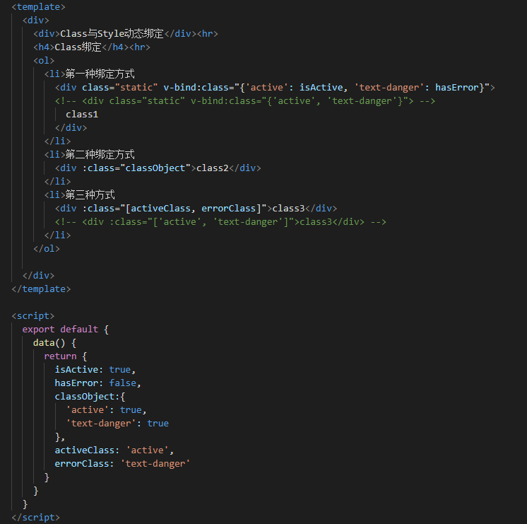

## style 绑定方式

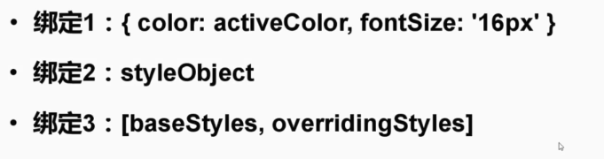

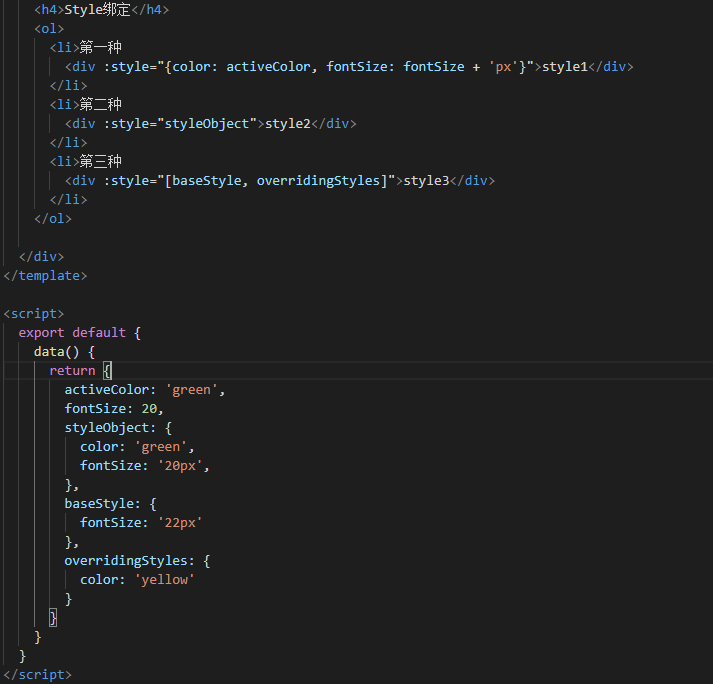

# 条件渲染 v-if v-else v-else-if

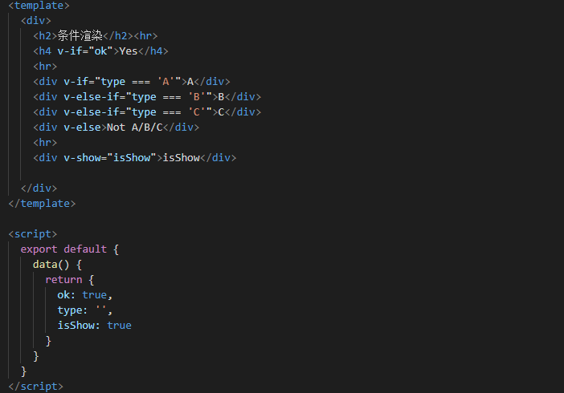

# 列表渲染 v-for

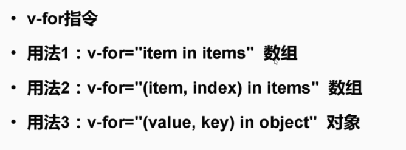

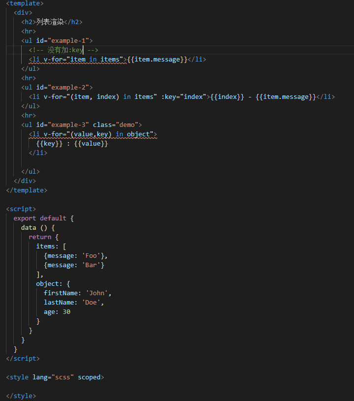

# 事件处理器

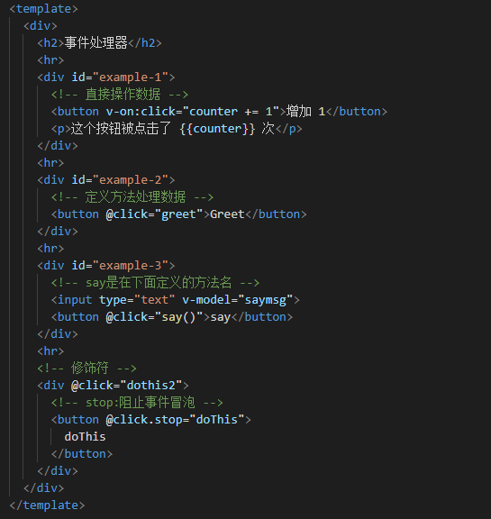

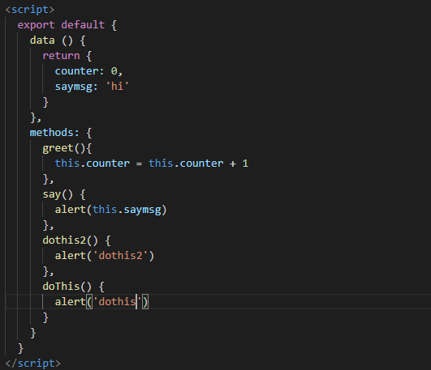

# 自定义组件

 之前的Demo都是下载src/pages/ 目录下， pages目录下可以理解为一个个的 页面

compontents 组件，是放在 页面内的。

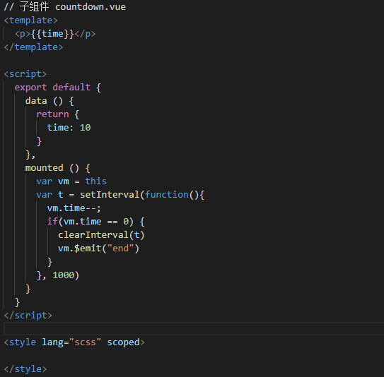

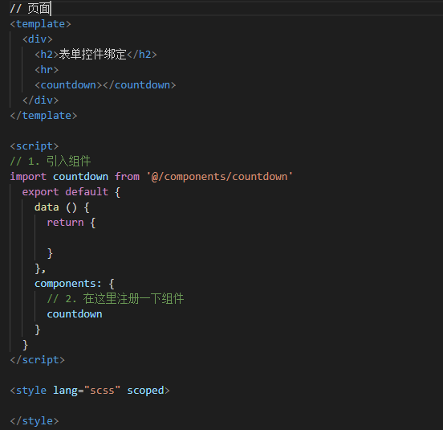

## [父子组件之间通信！](https://segmentfault.com/a/1190000014381699)

## VUE中的DOM操作  this.$refs

不建议使用VUE的时候直接操作DOM

非要操作的时候要在 **mounted** 生命周期函数里面使用，因为vue使用了虚拟DOM，挂载后也就变成了真实DOM

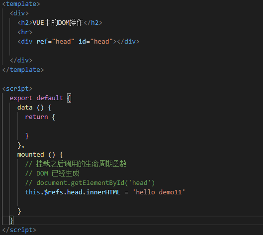

# 过渡效果 transition

通过样式的方式写过渡

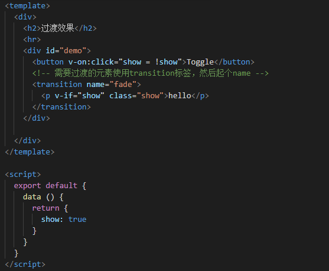

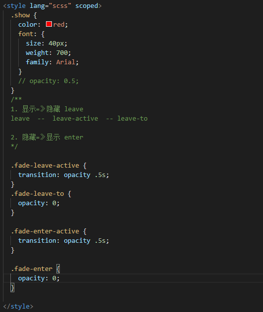

# [路由 vue-router](https://router.vuejs.org/zh/)

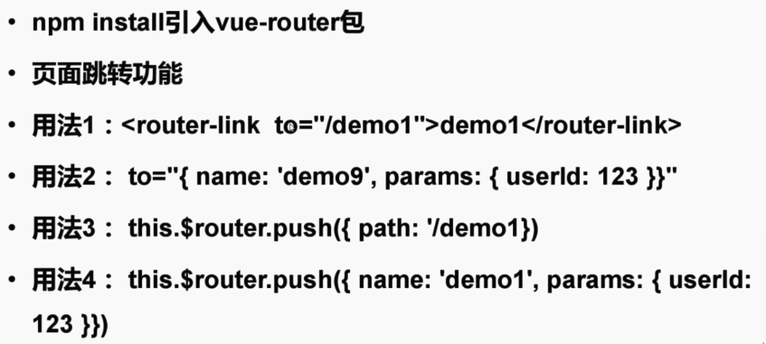

之前做的Demo每个页面都是单独的，在`router/index.js` 里面添加路由

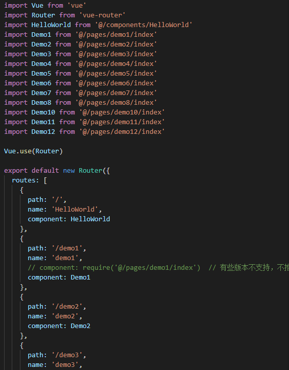

解决页面之间的跳转

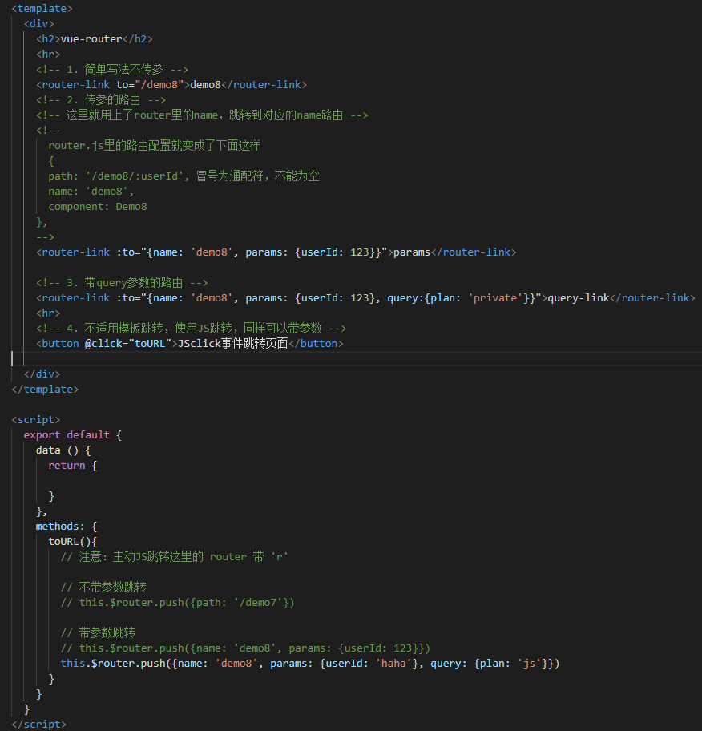

被跳转的页面 获取 params以及query： 

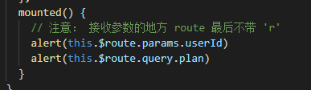

# ！状态管理 [vuex](https://vuex.vuejs.org/zh/)

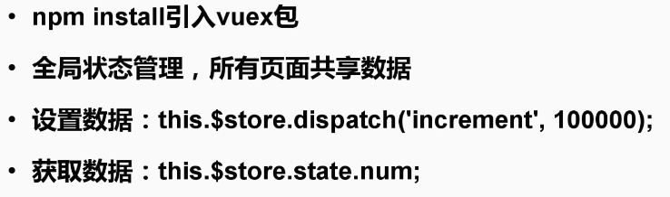

看图理解

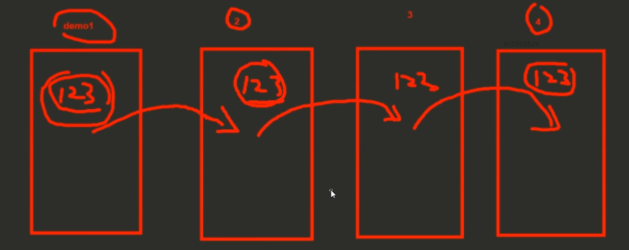

这种多页面跳转的话，通过路由传值就会变得特别麻烦

这时候只要有一个共享数据池，也就是全局状态管理，那么就不需要传了，直接去vuex里面取就可以了。

## 新建目录

vuex的store目录在 /src/目录下

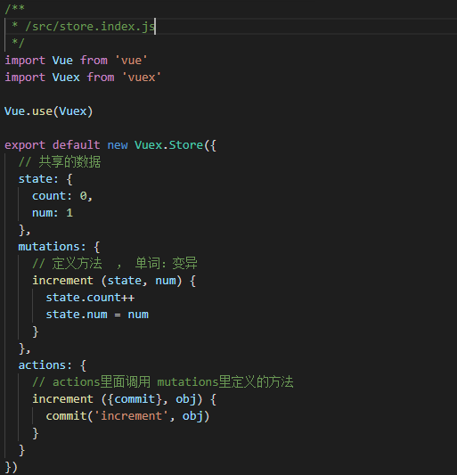

在Vue实例中使用

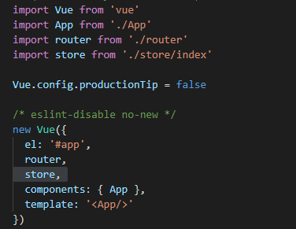

基本使用（获取、修改）

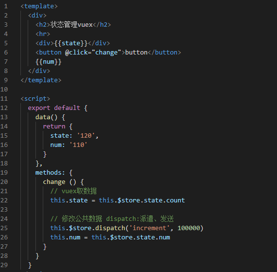

# Slot 插槽

常用于组件调用中

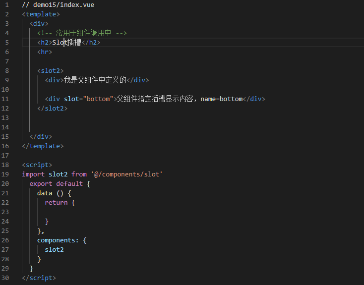

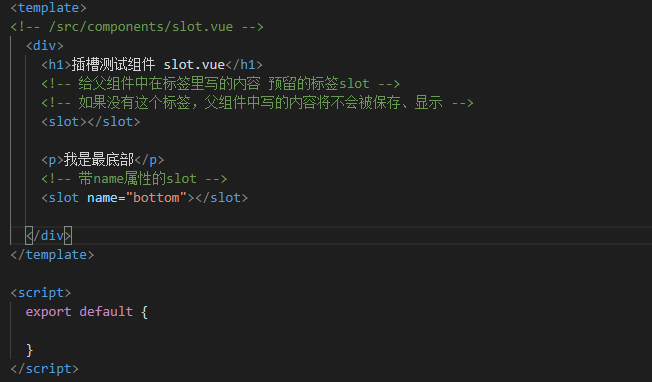

# vue-resource请求

类似ajax请求，给后台发送请求接口

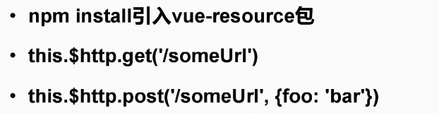

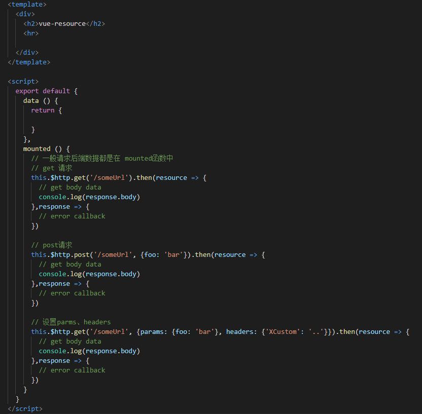

# 移动组件库 [Mint UI](http://mint-ui.github.io/docs/#/zh-cn)

前言：

VUE最主要的就是在做组件开发，最终还是要回归组件开发，大部分时间都是在做组件开发，每个页面只是调用开发的组件。上述就是别人写好的组件，打包好了，我们可以直接用。

