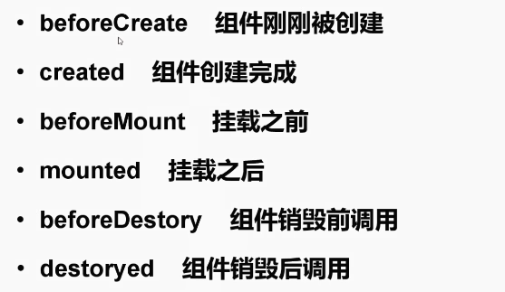

#  生命周期

## 图示




# 选项数据 data

+ data
+ computed
+ methods


# 模板语法

+ data
+ 模板中直接嵌入js代码
+ 指令 v-html、v-on、v-bind等
+ 计算属性
+ 过滤器


# 计算属性 computed

+ 在模板中放入太多的逻辑会让模板过重且难以维护
+ 计算属性下所有函数可以放到computed中


# Class与Style动态绑定  v-bind


## class 绑定方式


## style 绑定方式


# 条件渲染 v-if v-else v-else-if


# 列表渲染 v-for


# 事件处理器


# 自定义组件


 之前的Demo都是下载src/pages/ 目录下， pages目录下可以理解为一个个的 页面

compontents 组件，是放在 页面内的。


## [父子组件之间通信！](https://segmentfault.com/a/1190000014381699)

## VUE中的DOM操作  this.$refs

不建议使用VUE的时候直接操作DOM

非要操作的时候要在 **mounted** 生命周期函数里面使用，因为vue使用了虚拟DOM，挂载后也就变成了真实DOM


# 过渡效果 transition

通过样式的方式写过渡


# [路由 vue-router](https://router.vuejs.org/zh/)


之前做的Demo每个页面都是单独的，在`router/index.js` 里面添加路由


解决页面之间的跳转


被跳转的页面 获取 params以及query： 


# ！状态管理 [vuex](https://vuex.vuejs.org/zh/)


看图理解


这种多页面跳转的话，通过路由传值就会变得特别麻烦

这时候只要有一个共享数据池，也就是全局状态管理，那么就不需要传了，直接去vuex里面取就可以了。

## 新建目录

vuex的store目录在 /src/目录下


在Vue实例中使用


基本使用（获取、修改）


# Slot 插槽

常用于组件调用中


# vue-resource请求

类似ajax请求，给后台发送请求接口


# 移动组件库 [Mint UI](http://mint-ui.github.io/docs/#/zh-cn)

前言：

VUE最主要的就是在做组件开发，最终还是要回归组件开发，大部分时间都是在做组件开发，每个页面只是调用开发的组件。上述就是别人写好的组件，打包好了，我们可以直接用。

# 练手小项目

使用vue脚手架搭建

为了做移动端适配，使用 rem 布局， 新建 `/src/config/rem.js` 在`main.js` 下做配置

```javascript
// eslint-disable no-undef */
// 第一行做eslint忽略
!function(n){
  var  e=n.document,
       t=e.documentElement,
       i=720,
       d=i/100,
       o="orientationchange"in n?"orientationchange":"resize",
       a=function(){
           var n=t.clientWidth||320;n>720&&(n=720);
           t.style.fontSize=n/d+"px"
       };
       e.addEventListener&&(n.addEventListener(o,a,!1),e.addEventListener("DOMContentLoaded",a,!1))
}(window);
```

然后在 `main.js` 中引入一下 `import '@/config/rem'`  就可以使用了

**注意： 此章节配置都是基于vue-cli2 版本，cli3需另外研究**

px自动转换rem、可配置转换

1. 下载loader `npm i px2rem-loader`

2. 在 `/build/utils.js 中配置`

   

3. 使用，选择性转换

   

   在项目中任意地方使用，默认会将`px` 转换为`rem` ，后面加注释 `/* no */` 则为不转换

## 实现head 部分


**header是很多页面都会共享使用的，所以把它做成一个公共组件，可复用。**

# 项目2 商城

## 创建目录结构


## 静态文件准备

准备一些图片，主要学习scss的架构


## 项目初始化

把脚手架初始化的东西删掉，然后再加自己的东西

安装

`babel-polyfill` ：添加ES6的API使用

`fastclick`：解决移动端300毫秒点击

在`main.js`入口文件下配置


安装sass依赖 `node-sass`  `sass-loader`

`utils.js` 中已经预配置好了，不需要自己配置


`@` 代表 `/src` 路径，其实是在 `build/webpack.base.conf.js` 中配置的


可以自己再配置一些常用路径，如下


## 搭建项目骨架、分析

将 `<html>` 、 `<body>` 、 `app` 设置超出隐藏、宽高设置成100%

这时候就设置好了一个可视区，并且上面三个元素是无法滚动的，浏览器默认的滚动条被禁用

只需要再在里面设置子元素可滚动

在父组件、页面级父组件中，只做标签的占位，不会写具体代码，具体代码就放到子组件中写，易于复用。也就是说子组件不包含位置信息，位置信息交给父组件。

`App.vue`


新建 `_comtainers.scss`


在 `_base.scss` 中设置html、body宽高为 100%


## 底部tabbar导航条组件

组件创建到 `components/` 目录下，病床简称目录的形式，因为可能会包含一些资源文件，就近引入。


最后集成scss，创建 `_tabbar.scss`，将sass部分copy过去

**注意：** 因为项目使用flex布局，关于flex布局会经常用到，就要提取出一个mixin函数，就可以复用了。

在 `_mixins.scss` 中定义


定义居中，参数接收水平还是垂直排列，flex布局默认为row行排列

效果：


变为


最后，router-link 在被激活的时候会被加上 class`router-link-active`，

我们定义被激活后的样式，在 `tabbar/index.vue`中，这段css代码不需要集成


## vue-router

先把页面pages建好


在 `router/index.js/` 里配置路由

```javascript
import Vue from 'vue'
import Router from 'vue-router'
// import Home from 'pages/home'  // 路由懒加载后就不在这引入了 ！！
// import Cart from 'pages/cart'
// import Category from 'pages/category'
// import Personal from 'pages/personal'
// import Product from 'pages/product'

Vue.use(Router)

const routes = [
  {
    name: 'home',
    path: '/home',
    component: () => import('pages/home'),  // 路由懒加载 ！！
    children: [
      {
        name: 'home-product',
        path: 'product/:id',  // 子路由开始不能加斜杠 / ！！
        component: () => import('pages/product')
      }
    ]
  },
  {
    name: 'cart',
    path: '/cart',
    component: () => import('pages/cart')
  },
  {
    name: 'category',
    path: '/category',
    component: () => import('pages/category')
  },
  {
    name: 'personal',
    path: '/personal',
    component: () => import('pages/personal')
  },
  {
    path: '*',  // 在输入的路由匹配不到的时候就会自动跳转home
    redirect: '/home'
  }
]

export default new Router({
  routes  // ES6写法
})

```

## 首页开发

### 结构、样式

`App.vue` 中代码


首页包裹在 `.g-view-container` 容器中

分析首页的组件： topbar、 backtop、以及中间的显示区域

同样，在home.vue 中先把位置信息写好


然后在 `_container.scss` 中写各个container的样式


然后在`home.vue` 中写一下大的 `class = home` 的样式


### 导航条

在 `components/home` 下新建 `header.vue` 子组件文件，这样维护起来就很方便了

这里把header抽象出一个基础组件，**与业务逻辑无关的**，具体里面放什么内容就通过插槽提供。

新建`src/base/index.vue` ，编写插槽


在`pages/home/header.vue` 中使用


#### 解决导航条前面两个元素不存在时，消息图标不会在最右边


### 导航条在其他页面样式

购物车页面： 中间的文字是相对整个导航条居中的，并且超出文字会显示省略号


添加标题 h1 标签，并定义传入title属性才会显示


附： ellipsis样式：


## 幻灯片组件

借助Swiper来实现，但是swiper不是针对vue开发的，所以要使用 Vue-Awesome-Swiper

，基于Swiper4

下载`npm i --save vue-awesome-swiper` 

在 `/home` 下创建幻灯片组件并引入

由于 幻灯片组件和业务关系不大，是很通用的基础组件，所以在base里再创建一个基础组件MeSlider

引入基础组件，我们要做： 在基础组件上面包装一层，填充相关数据变成 业务组件。

1. 新建 `base/slider/index.vue`

   

   

2.  创建 `home/slider.vue` 子组件

   

   

   把幻灯片相关的配置写到了 `home/config.js` 文件下了

   

## 异步请求服务器端的数据

使用 axios，新建 `api/home.js` 专门处理 home页面下的请求


然后在 `home/slider` 下使用接口，替换数据


但是！ 现在会出现BUG： 明明开了无缝滚动，但是却没有效果

是因为在 异步数据 获取之前，就已经调用了基础slider组件，组件已经初始化了，里面没有数据也就是空空如也，那么就没有办法进行内部的运算，无缝滚动也就出现了BUG

解决办法： 等数据获取完成，再渲染slider组件。


v-if：只有值为true的时候才会加载组件，和v-show的区别：v-show是先加载然后隐藏在DOM中，设置了 display=none

这样就可以正常显示了

最终添加错误处理后的 `api/home.js`


`api/config.js`


## Loading 组件

新建 `base/loading`


在 `home/slider.vue` 中使用


## 滚动条组件

滚动条组件是和业务无关的组件，创建 `base/scroll/index.vue`，在home组件中引入

滚动条使用的是`vue-awesome-swiper` 所以再scroll组件中引入

对于滚动条来说，swiper里面就只有一个swiperSlide，所有可以滚动的内容都在这个swiperSlide里面

`base/scroll`


而且！ 可视区高度应该只是可视区的高度，不能被内容撑开，内容的高度可以很高

`home/index.vue` 滚动条组件包裹所有内容


然后需要设置样式：

可视区不让内容撑开，设置宽高为100%，让可视区撑开他父容器

然后内容高度为auto即可

`base/scroll/index.vue`


## 导航面板

新建 `home/nav/index.vue`


使用flex布局


## 热卖推荐

### jsonp封装

npm安装 jsonp库

jspnp的API如下：


我们要对它做一层封装： 

1. 使用promise代替回调fn
2. 支持传入data

`assets/js/jsonp.js`


### 从服务器端获取数据

在 `api/home.js`下暴露方法，供 `hone.vue` 获取热门推荐数据


`api/config.js`


`recommend.vue`


### 结构和样式

`home/recommend.vue`


### 更新滚动条

现在样式写完了，但是滚动条不能滚动了

是因为 数据是异步加载的，在滚动条组件加载完成的时候，数据还没有过来，所以滚动条无法计算现在的高度，就无法滚动，方法有2： 

1. 通过传参数让滚动条自己更新

2. 滚动条组件暴露一个API，在父组件可以调用方法更新滚动条

   子组件`recommend`更新完数据冒泡，父组件`home`更新滚动条

在 `recommend.vue` 中，通过 `$emit` 暴露loaded方法，传出recommends，原理就是子组件向父组件传值


在 `home/index` 中接收事件


首页接收到recommends后，给滚动条`me-scroll`传入 data数据，默认是一个空数据，当加载好之后就变成一个有值的数组，这样值发生了变化，就可以在 `me-scroll`中 watch变化，然后更新滚动条


`base/scroll/index`

先接收传入的data


watch数据的改变，改变后就调用update方法


怎么获取swiper实例？ 传入ref值


**伏笔： 这么写还有问题，现在还有没暴露出来， TODO**

### 懒加载

使用 `vue-lazyload` 插件

在 `main.js` 下注册


使用的时候只需要把 `:src` 改成 `v-lazy` 就可以了


## 下拉刷新

在滚动条组件中添加 loading 动画组件

`base/scroll/index`  相对来说是父组件


swiper提供监听下拉长度的事件，拉到100px就改变文字、刷新

在swiper的配置项里面使用 API


添加scroll() 方法


`base/loading` 相对是子组件

添加修改文本的方法供父组件调用


## 松手刷新

监听松手事件，swiper提供了事件 touchEnd

`base/scroll`  添加swiper原生事件


然后在它的父组件 `home/index.vue` 中监听pull-down


