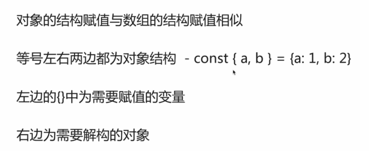

# ECMAScript6

ECMA（European Computer Manufactures Association）欧洲计算机制造联合会。

ES是JS的标准

JS是ES的实现

JS是1995年网景公司（NetScape）的布兰登·艾奇（Brendan Eich）发明的。


## 版本历史

1998-06	ES2

1999-12	ES3 发布，成为js的通行标准

2007-10	ES4 草案发布，内容很激进

2008-07	将ES小部分内容提取，发布为ES3.1，后改名为ES5

2009-12	ES5发布，也就是ES3.1

2011-06	ES5.1发布，并称为了ISO国际标准

2013-03	ES6草案冻结，不加入新功能

2015-06	ES6正式通过，称为国际标准

# let

let声明的变量只在当前（块级）作用域内有效。

let声明的变量不能被重复声明。

不存在变量提升。

块级作用域：就是花括号{}括起来的范围，对象除外。

```javascript
// 块级作用域
{
    var a = 1;
    var b = 2;
}
a;  // 1
b;  // 报错

// let 只作用在当前块级作用域内
for (let i=0; i<3; i++){
    console.log(i);  // 正常访问
}
console.log(i);  // 访问报错

// 使用let或者const声明的变量  不能再被声明
var dad = "爸爸";
console.log(dad);  // "爸爸"
var dad;
console.log(dad);  // "爸爸"  只声明不修改的话是不会改变的
let son = "儿子";
let son;  // 会报错，不允许重复声明

// let 不存在变量提升
console.log(dad);  // undefined 不会报错
var dad = '爸爸';
//
console.log(dad);  // 报错，没有提升
var dad = '爸爸';

// 暂存死区
var monkey = '我是美猴王';
{
    console.log(monkey);  // '我是美猴王'
    var monkey = "新猴王";
}
console.log(monkey);  // "新猴王"
//
let monkey = '我是美猴王';
{
    console.log(monkey);  // 报错，这就是死区
    let monkey = "新猴王";
}
console.log(monkey);  // "我是美猴王"
```

let、var区别 实例

```javascript
// q：生成十个按钮  每个按点击的时候弹出 1 - 10
var i = 0;
for (i=1; i<=10;i++){
    (function(i){
        var dtn = document.createElement('button');
        btn.innerText = i;
        btn.onclick = function(){
            alert(i);
        };
        document.body.appendChild(btn);
    })(i);
}
```

效果如下图，点击不同的按钮会弹出按钮上的数字。


但是如果把自执行的匿名函数去掉：

```javascript
// q：生成十个按钮  每个按点击的时候弹出 1 - 10
var i = 0;
for (i=1; i<=10;i++){
        var dtn = document.createElement('button');
        btn.innerText = i;
        btn.onclick = function(){
            alert(i);
        };
        document.body.appendChild(btn);
}
```

页面效果还是和上图一样，但是弹出的数字全都变成了11。

但是把i改成let声明，就会解决这个问题。

```javascript
// q：生成十个按钮  每个按点击的时候弹出 1 - 10
for (let i=1; i<=10;i++){
        var dtn = document.createElement('button');
        btn.innerText = i;
        btn.onclick = function(){
            alert(i);
        };
        document.body.appendChild(btn);
}
```

# const

声明常量 - 不可改变的量。

常量必须在声明的时候赋值，否则会报错：Missing initializer in const declaration。

与let类似的特性

+ 不能重复声明
+ 不存在提升
+ 只能在当前（块级）作用域内有效。

但是  常量为引用类型的时候  不能保证不可变，但是修改的话修改的也不是常量本身。

```javascript
const xiaoming = {
    age: 14,
    name: "小明"
};
console.log(xiaoming);
xiaoming.age = 22;
console.log(xiaoming);  // 是可以修改内部的age的
xiaoming = {};  // 报错
// const只能保证 声明的常量指向的地址不被改变，不能保证地址上的值不被改变。
```

Q：

+ 怎么解决引用类型的常量可以被修改？

  `Object.freeze();`

  把一个对象冻结，失去被修改的能力，同样也不能被扩展了。

+ ES6之前怎么声明常量?

  ```javascript
  // TODO
  ```


# 解构赋值

解构赋值语法是一个JavaScript表达式，这使得可以将值从数组或属性从对象提取到不同的变量中。

## 数组的解构赋值

```javascript
const arr = [1,2,3,4];
let [a,b,c,d] = arr;  // 取abcd
const [,b] = arr;  // 取b
const [ , , g] = ['e', 'f', 'g'];  // 取g

const [ , , [ , , g]] = ['c', 'd', ['e', 'f', 'g']];  // 取出g

// 扩展运算符
const arr1 = [1, 2, 3];
const arr2 = ['a', 'b'];
const arr3 = ['zz', 1];
const arr4 = [...arr1, ...arr2, ...arr3];  // 三个点就是扩展运算符，可以把三个数组合并为一个数组
const arr = [1, 2, 3, 4];
const [a, b, ...c] = arr;  // c就是[3, 4];

// 默认值
const arr = [1, undefinded, undefinded];
const [a, b = 2, c, d] = arr;  // d就是默认的undefined， b的默认值是2

// 交换变量
let a = 20;
let b = 10;
let temp;
temp = a;
a = b;
b = temp;
// 或者
[a, b] = [b, a];

// 接收多个 函数返回值
function getUserInfo(id){
    //  ... ajax
    return {
        true,
        {
        	name: 'xiaoming',
        	gender: 'nv',
        	id: id
    	},
        '请求成功',
    }
}
const [status, data, msg] = getUserInfo(123);
```

## 对象的结构赋值

类似数组的解构赋值



